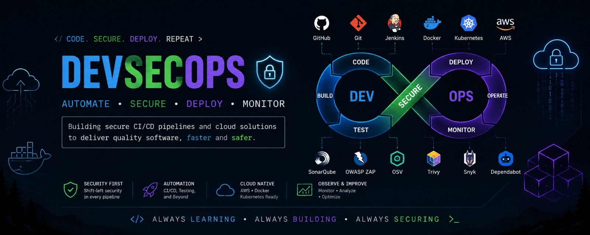

<p align="center">
  
</p>

<h1 align="center">Hi, I'm Himani 👋</h1>

<p align="center">
  <b>DevSecOps • Cloud Security • Software Engineering</b>
</p>

<p align="center">
  Building secure and automated software delivery systems while learning
  DevSecOps, cloud security and software engineering.
</p>

<p align="center">
  <a href="https://github.com/himanidhawan4">
    
  </a>
</p>

---

<table>
<tr>
<td width="100%">

## 🚀 Currently Working On

### 🔐 SecureDeploy

**SecureDeploy** is my major DevSecOps project focused on integrating security into the software delivery lifecycle.

The goal is to create a system where a Pull Request can be automatically analysed for security issues before it reaches deployment.

### 🔄 Planned Workflow

```text
GitHub Pull Request
        │
        ▼
 GitHub Webhook
        │
        ▼
     Jenkins
        │
   ┌────┴────┐
   ▼         ▼
SonarQube   OSV
   │         │
   └────┬────┘
        ▼
 Security Engine
        │
        ▼
 Security Scorecard
        │
        ▼
  Security Gate
     │       │
   FAIL     PASS
     │       │
     ▼       ▼
  Report   Deployment
              │
              ▼
       Admin Approval
              │
              ▼
        Docker Build
              │
              ▼
          AWS Deploy
```
</td> </tr> </table>
<table> <tr> <td width="100%">
✨ Planned Features
Feature	Description
🔎 PR Security Analysis	Automatically analyse GitHub Pull Requests
🛡️ SonarQube	Static code quality and security analysis
📦 OSV	Dependency vulnerability scanning
📊 Security Scorecard	Generate an analytical security score
🚦 Security Gates	Block deployment when defined security conditions fail
💡 Error Explanation	Explain why a security issue matters
⚠️ Consequences	Show potential impact of detected vulnerabilities
🔧 Remediation	Provide useful remediation guidance
⚙️ Jenkins	Automate CI/CD workflows
🐳 Docker	Containerize builds and deployment
☁️ AWS	Deploy approved applications to AWS
🔐 Authentication	Secure user authentication
👥 RBAC	Role-Based Access Control
👨‍💼 Admin Approval	Require authorized approval before deployment
📝 Audit History	Track security and deployment activity
</td> </tr> </table>
<table> <tr> <td width="50%" valign="top">
💻 Languages

🐍 Python

⚡ C++

☕ Java

</td> <td width="50%" valign="top">
🔐 DevSecOps

🔧 Git

🐙 GitHub

⚙️ Jenkins

🐳 Docker

🔎 SonarQube

📦 OSV

</td> </tr> <tr> <td width="50%" valign="top">
☁️ Cloud

☁️ AWS

🔑 IAM

</td> <td width="50%" valign="top">
⚙️ Backend & Database

🚀 FastAPI

🐘 PostgreSQL

</td> </tr> </table>
<table> <tr> <td width="50%" valign="top">
📚 Currently Learning

🧠 Data Structures & Algorithms

🐧 Linux

☁️ AWS & Cloud Security

🔐 DevSecOps

⚙️ CI/CD

🛡️ Secure Software Development

🌐 Networking Fundamentals

🗄️ Database Fundamentals

</td> <td width="50%" valign="top">
🔭 Exploring

🔐 Application Security

🛡️ DevSecOps

☁️ Cloud Security

⚙️ CI/CD Automation

🐳 Container Security

🔎 Vulnerability Management

🌐 Secure Software Development

</td> </tr> </table>
<h2>🚀 Projects</h2> <table> <tr> <td width="33%" valign="top"> <h3>🔐 SecureDeploy</h3>

<b>DevSecOps Security & Deployment Platform</b>

<p> GitHub PR security analysis → security reporting → security gates → controlled AWS deployment. </p>

<b>Stack</b>

<br><br>

<code>Python</code>
<code>FastAPI</code>
<code>Jenkins</code>
<code>Docker</code>
<code>AWS</code>
<code>PostgreSQL</code>

<br><br>

🚧 <b>In Development</b>

</td> <td width="33%" valign="top"> <h3>🛡️ PR Security Bot</h3>

<b>Automated GitHub PR Security Analysis</b>

<p> A security automation project designed to analyse Pull Requests and provide security findings. </p>

<b>Planned</b>

<br><br>

• Webhooks<br>
• Security scanning<br>
• Vulnerability detection<br>
• Security reports<br>
• PR feedback

<br><br>

🚧 <b>Building</b>

</td> <td width="33%" valign="top"> <h3>⚙️ Secure CI/CD</h3>

<b>Security-focused Jenkins Pipeline</b>

<p> A Jenkins-based CI/CD pipeline integrating automated testing and security checks. </p>

<b>Pipeline</b>

<br><br>

<code>GitHub</code><br>
↓<br>
<code>Jenkins</code><br>
↓<br>
<code>Tests</code><br>
↓<br>
<code>SonarQube</code><br>
↓<br>
<code>OSV</code><br>
↓<br>
<code>Docker</code>

<br><br>

🚧 <b>Building</b>

</td> </tr> </table>
<table> <tr> <td width="100%">
🎯 Goals

🎓 Become placement-ready in DSA

🔐 Build strong DevSecOps projects

☁️ Develop expertise in Cloud Security

⚙️ Understand secure CI/CD practices

🐳 Learn container security

🚀 Build production-oriented systems

🌍 Contribute to open source

📈 Continuously improve through hands-on projects

</td> </tr> </table>
<h2>📈 My Development Journey</h2> <table> <tr> <td align="center">

<b>Programming Fundamentals</b>
<br>
↓
<br>
<b>Data Structures & Algorithms</b>
<br>
↓
<br>
<b>Git & GitHub</b>
<br>
↓
<br>
<b>Linux & Networking</b>
<br>
↓
<br>
<b>CI/CD</b>
<br>
↓
<br>
<b>Docker</b>
<br>
↓
<br>
<b>DevSecOps</b>
<br>
↓
<br>
<b>AWS & Cloud</b>
<br>
↓
<br>
<b>Cloud Security</b>
<br>
↓
<br>
<b>SecureDeploy</b>

</td> </tr> </table>
<table> <tr> <td width="100%">
🧩 Current Focus
Area	Focus
🧠 DSA	Problem solving & placement preparation
🔐 DevSecOps	Secure software delivery
☁️ AWS	Cloud & deployment
🐳 Docker	Containerization
⚙️ Jenkins	CI/CD automation
🛡️ Security	Vulnerability detection & security gates
🚀 SecureDeploy	Major project
</td> </tr> </table>
<h2>📊 GitHub Activity</h2> <p align="center">  </p> <p align="center">  </p>
<table> <tr> <td width="100%">
💡 My Approach
<p align="center">

<b>Learn</b>
<br>
↓
<br>
<b>Build</b>
<br>
↓
<br>
<b>Break</b>
<br>
↓
<br>
<b>Debug</b>
<br>
↓
<br>
<b>Understand</b>
<br>
↓
<br>
<b>Improve</b>
<br>
↓
<br>
<b>Repeat</b>

</p>

I believe the best way to learn engineering is by building real systems,
understanding why they fail, and continuously improving them.

</td> </tr> </table>
<h2>🤝 Let's Connect</h2> <p align="center"> <a href="https://github.com/himanidhawan-cloud">  </a> </p>
<p align="center"> <b>Thanks for visiting my profile! 🚀</b> </p> <p align="center"> <i>Learning by building, breaking, debugging and improving.</i> </p>
